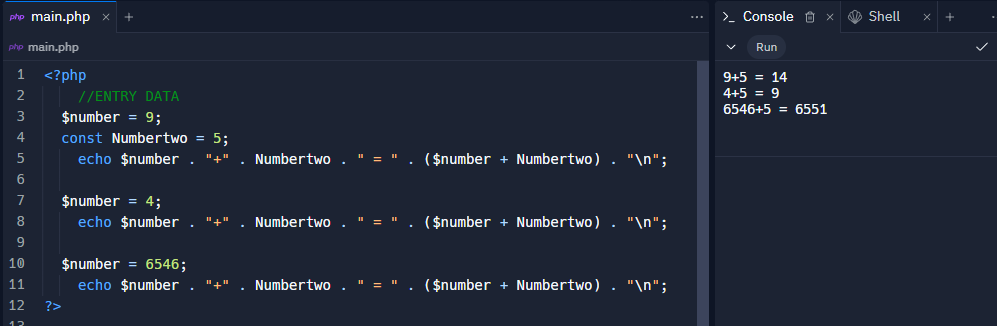
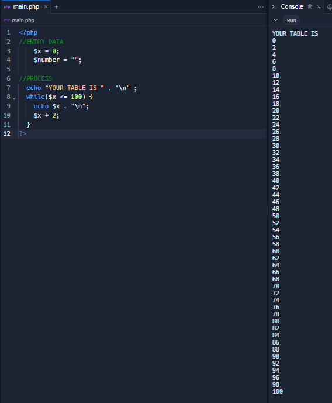

<h1>Taller 10 - Cristian Felipe Patiño Caceres</h1>

<h2>Informacion</h2>

Curso: Full stack Basico - Grupo 1

Profesor: Cristian Patiño

<h2>Punto 1: Constantes y Variables</h2>
    

<h2>Punto 2: Sumas de Constantes y Variables</h2>
    

<h2>Punto 3: Sumas de dos numero indicados por el usario</h2>

<h2>Punto 4: Datos del usuario en consola</h2>
    

<h2>Punto 5: Entrada de bolera usando if / else</h2>
    

<h2>Punto 6: Deteccion de mayoria de edad</h2>
    

<h2>Punto 7: Seleccion de operacion aritmetica</h2>
    

<h2>Punto 8: Entrar a la bolera usando Swicth</h2>
    

<h2>Punto 9: Tabla de multiplicar usando while</h2>
    

<h2>Punto 10: Numero pares usando while</h2>

<h2>Punto 11: Numero inpares usando for</h2>
    

<h2>Punto 12: Tabla de multipicar usando for</h2>
    

<h2>Punto 13: Suma de valores de un arreglo usando foreach</h2>

<h2>Punto 14: Revision de contraseña</h2>

<h2>Punto 15: Seleccion de operacion aritmetica usando funciones</h2>
    
    